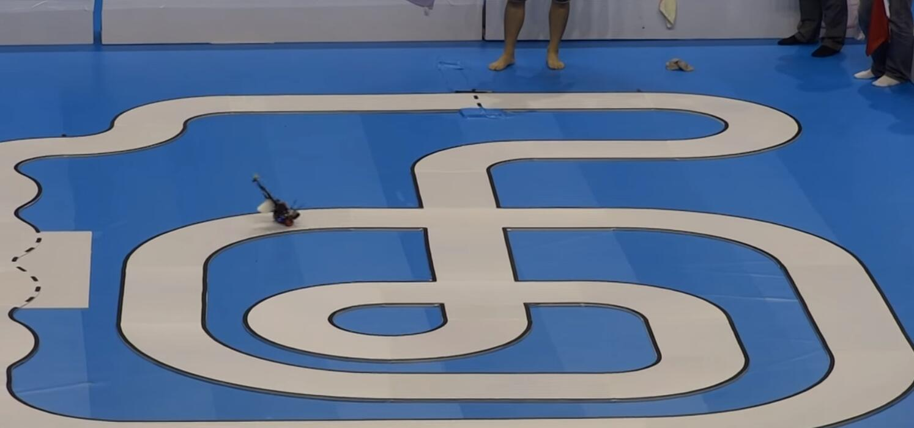

# Self Balancing Car
This is a self-balancing car I built in 2013.I built this robot for the Freescale Cup Smart Car Competition.This car runs on two wheels,it uses gyro and accelerometer to detect the tilt angle and uses three PID controller to keep the car balanced,running,and navigating along the race track.

You can check out my competition video here.

And here are some snapshots of my car.

### Want more detail about this project? ###

A detailed explanation of the hardware and coding on my website [Building A Self Balancing Race Car](http://lichaoma.com/2015/11/17/self-balancing-smart-car-based-on-freescale-mc9s12x128/)

I also modeled the car in Solidworks,you can download the model from my [GrabCAD](https://grabcad.com/library/self-balancing-car-1) account.
